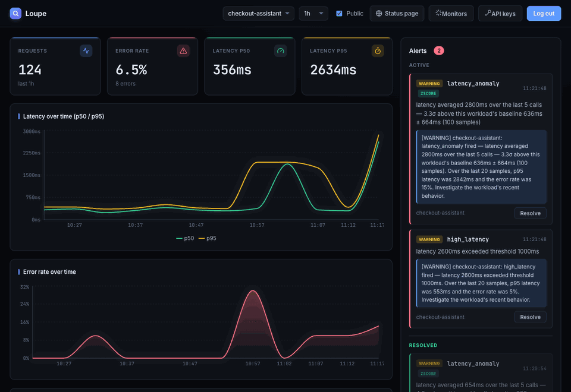
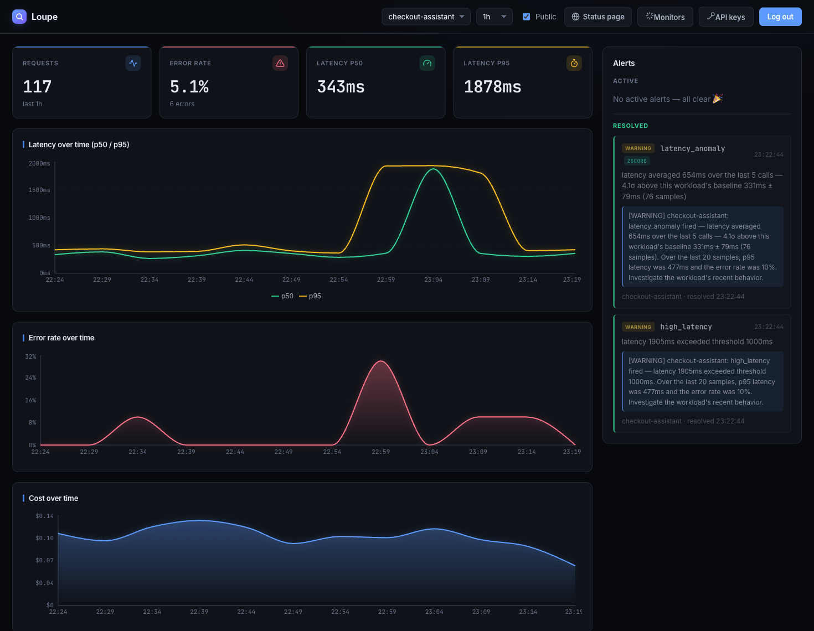
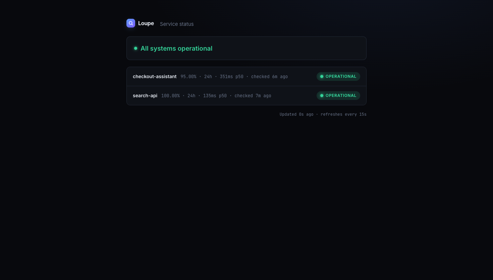
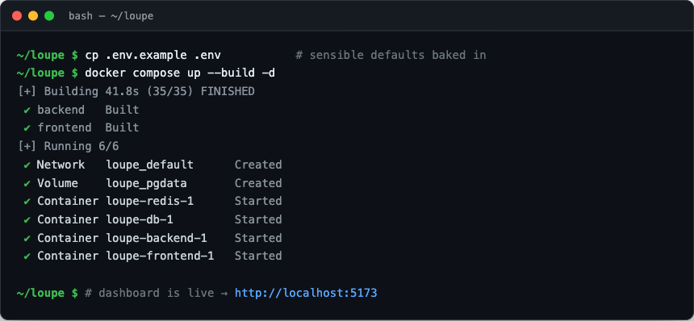
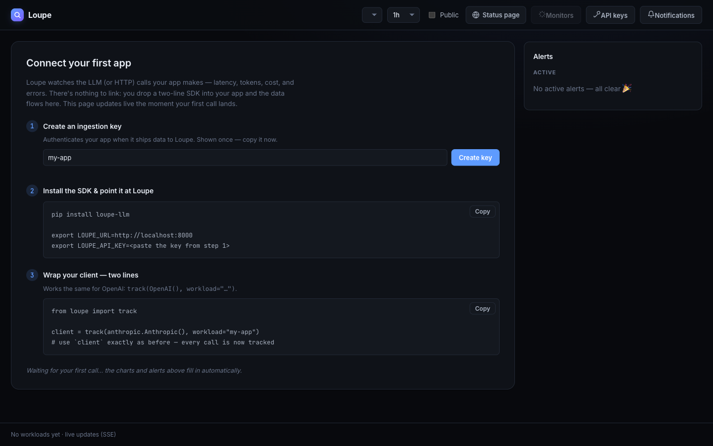
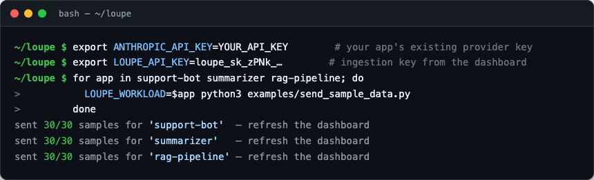
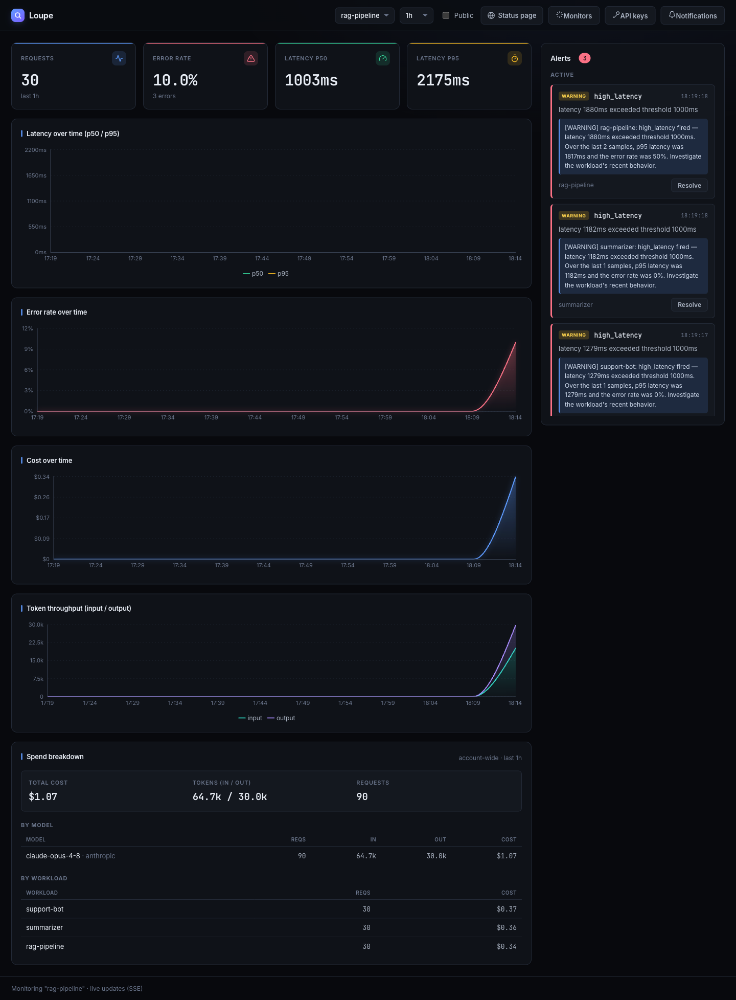

# 🔎 Loupe

[](https://github.com/paarth6011/loupe/actions/workflows/ci.yml)
[](https://github.com/paarth6011/loupe/releases)
[](LICENSE)

**Open-source observability for LLM apps.** Track the latency, tokens, and cost of
every AI call your app makes — with explainable alerts and plain-English incident
summaries. Self-host the whole stack for **$0, no API key required**, or use the
hosted version.

*A loupe is the magnifier you use to inspect fine detail — this one shows you what
every LLM call really costs.*

> **▶ Don't want to run it yourself?** Loupe is hosted at
> **[getloupe.net](https://getloupe.net)** — free while it's in beta. Everything
> below covers self-hosting, which stays a first-class, $0 option.

## What you get

- **📊 Cost & token tracking** — every call's tokens turned into dollars from local
  pricing tables (computed offline, no extra API call).
- **⚡ Latency & error monitoring** — p50/p95 latency, error rate, and request
  counts per workload.
- **🔔 Explainable alerts** — fixed thresholds *plus* a per-workload z-score
  baseline that flags what's abnormal *for that workload*. Every alert spells out
  the numbers — no black-box models.
- **🧠 Plain-English summaries** — optional one-line incident summaries ($0
  template, or Claude / a local Ollama model).
- **📣 Slack & Discord alerts** — per-account or global webhooks when an alert
  fires or resolves.
- **🌐 Public status page** — an opt-in, no-auth health page for the workloads you
  choose to publish.
- **🪄 Two-line SDK** — wrap your Anthropic/OpenAI client and every call is
  observed automatically.
- **🔄 Live dashboard** — updates pushed as data lands (Server-Sent Events), not
  constant polling.

## Demo



<details>
<summary>Individual screenshots</summary>

| Dashboard (latency · tokens · cost · alerts) | Public status page |
|---|---|
|  |  |

</details>

**Jump to:** [Is Loupe for me?](#is-loupe-for-me) · [Quickstart](#quickstart) ·
[See it run locally](#see-it-run-locally) · [Instrument your app](#instrument-your-app-sdk) ·
[Self-host for $0](#self-host-for-0) · [Services & API](#services--ports) ·
[Configuration](#configuration) · [Costs & API keys](#costs--api-keys)

## Is Loupe for me?

Loupe is for **developers and teams whose code calls an LLM API** — a chatbot, a
summarizer, an agent, anything that hits Claude, GPT, or a local model
programmatically. If you have an **API key** and an app making calls, Loupe wraps
your client and watches them: latency, tokens, cost, errors, and alerts.

It's **not** for using Claude or ChatGPT as a chat product. A Pro/Plus
subscription lets you *type into an assistant* — there's no code, no API key, and
no running service to observe. (You're the end user of someone else's app; *that
someone* is who Loupe is for.)

| You are… | API key? | Fit |
|---|---|---|
| A dev/team calling an LLM API — pay-as-you-go *or* committed/enterprise | yes | ✅ wraps your client, observes every call |
| On a Pro/Plus chat subscription only, no API key | no | ❌ nothing to instrument — no running app |

It isn't only about cost, either: even on a flat bill, Loupe answers *"is my app
slow? is it failing? did that 3am deploy break it?"*

## Quickstart

```bash
cp .env.example .env        # optional — sensible defaults are baked in
docker compose up --build   # brings up db + backend + frontend (empty instance)
```

Open **http://localhost:5173**. In local dev you're signed in automatically — no
login screen. (A deployed `ENVIRONMENT=production` instance requires a real login
and refuses to boot on the default password.) The instance starts empty;
[instrument an app](#instrument-your-app-sdk) to fill it with your own data.

**Want a live demo first?** Start the optional prober — it measures real public
HTTP endpoints (latency + up/down), so the charts and alerts populate in seconds:

```bash
docker compose --profile demo up -d   # adds the prober (canned demo data)
```

## See it run locally

From an empty box to a live dashboard in two terminals — entirely on your own
machine, no cloud account and no API key required.

**1 · Launch the stack.** One command builds and starts the database, backend, and
dashboard:



**2 · Open the dashboard.** It's live at **http://localhost:5173** and starts
empty, with a step-by-step *"connect your first app"* guide:



**3 · Send it some calls.** Create an ingestion key, point the SDK at Loupe, and
your app's LLM calls flow in. *(Here a tiny generator stands in for a real app; the
`ANTHROPIC_API_KEY` is your app's own provider key — Loupe never needs one of its
own.)*



**4 · Watch it fill in.** Latency (p50/p95), error rate, token throughput,
cost-per-model and per-workload, and explainable alerts — all updating live over
SSE:



## Instrument your app (SDK)

The [`loupe` Python SDK](sdk/) wraps your Anthropic/OpenAI client so each call's
latency, tokens, cost, and errors flow into Loupe — in two lines:

```bash
pip install loupe-llm   # distribution name; the import stays `loupe`
```

```python
from loupe import track
client = track(anthropic.Anthropic(), workload="support-bot")
# use `client` exactly as before — calls are now observed
```

Create a per-source ingestion key in the dashboard (**🔑 API keys**) and set
`LOUPE_API_KEY` so the SDK authenticates without the admin password.

## Self-host for $0

Run the **whole stack on one VM** — backend, Postgres, Redis, frontend — behind
[Caddy](https://caddyserver.com) with automatic HTTPS, on a free
[DuckDNS](https://www.duckdns.org) subdomain. Frontend at `/` and API at `/api`
share one host, so they're **same-origin (no CORS)**, and the TLS cert is issued
automatically on first boot.

```bash
cp .env.prod.example .env   # set PUBLIC_URL/PUBLIC_DOMAIN + strong secrets
docker compose -f docker-compose.prod.yml up -d --build
```

Step-by-step walkthrough on an always-free VM (no domain to buy):
**[DEPLOY-gcp.md](DEPLOY-gcp.md)** — Google Cloud `e2-micro`. The same single-host
setup works on any small VM (e.g. Oracle Cloud's free ARM tier).

> ⚠️ The prod backend runs with `ENVIRONMENT=production`, which **requires a real
> login and refuses to boot on default secrets** — set `JWT_SECRET` and
> `ADMIN_PASSWORD` in `.env` before launching.

## Services & ports

| Service     | URL / port              | What it is                                 |
|-------------|-------------------------|--------------------------------------------|
| frontend    | http://localhost:5173   | React + TypeScript dashboard (nginx)       |
| backend     | http://localhost:8000   | FastAPI API (`/docs` for Swagger UI)       |
| db          | localhost:5432          | PostgreSQL 16                              |
| redis       | localhost:6379          | Redis 7 (caches `/metrics/summary`)        |
| prober      | —                       | Probes real HTTP endpoints (latency + up/down) |

The backend runs `alembic upgrade head` on startup, so the schema is created
automatically on first boot.

### API surface

- `GET  /health` — liveness probe (no auth)
- `GET  /ready` — readiness probe: checks Postgres + Redis are reachable
- `POST /auth/login` → JWT
- `POST /metrics` (auth: API key via `X-API-Key`, or admin JWT) — ingest a sample; evaluates thresholds on insert
- `POST /apikeys` · `GET /apikeys` · `DELETE /apikeys/{id}` (admin JWT) — manage ingestion keys
- `GET  /workloads` (auth)
- `PATCH /workloads/{id}` (auth) — publish/unpublish a workload on the status page
- `GET  /status` (**no auth**) — public status page: health of published workloads only
- `GET  /metrics/summary?workload_id=&window=` (auth) — p50/p95, error rate, count, tokens, cost
- `GET  /metrics/timeseries?workload_id=&window=&bucket=` (auth) — bucketed latency/errors + tokens/cost
- `GET  /metrics/cost?window=` (auth) — account-wide spend, broken down by model and workload
- `GET  /alerts` (auth) — supports `?workload_id=` and `?resolved=` filters
- `POST /alerts/{id}/resolve` · `POST /alerts/{id}/reopen` (auth) — manually resolve an alert (e.g. one whose workload went quiet) or undo that
- `GET  /workloads/{id}/monitors` (auth) — every rule's effective config for a workload
- `PUT  /workloads/{id}/monitors/{rule}` (auth) — enable/disable or override a rule's threshold
- `GET  /workloads/{id}/baselines` (auth) — the workload's learned seasonal baselines (typical value per metric and hour) for the "typical latency by hour" view
- `GET  /notifications` · `PUT /notifications` (auth) — get/set the account's Slack/Discord alert webhook (URL validated to an https Slack/Discord host)
- `POST /notifications/test` (auth) — send a sample alert to confirm the webhook works
- `POST /admin/prune?days=N` (operator) — trigger a data-retention sweep on demand
- `POST /admin/refresh-baselines` (operator) — recompute the seasonal anomaly baselines for every tenant on demand
- `POST /auth/stream-ticket` (auth) — exchange the admin token for a short-lived, read-only ticket for the live stream
- `GET  /events?ticket=<ticket>` — Server-Sent Events stream; pushes a `changed` event when new data lands so the dashboard refetches without fixed-interval polling

## Tests

```bash
docker compose exec backend python -m pytest -q
```

## Configuration

All config is via environment variables (see `.env.example`) — sensible defaults
are baked in, so you can start with Quickstart and tune later. The sections below
describe each group of settings.

### Alerts

Latency and error-rate alerts are on by default. **LLM-tuned alerts** add three
more rules, evaluated on ingest:

| Rule | Fires when | Threshold var (default) |
|---|---|---|
| `cost_spike` | a single call costs more than the ceiling | `COST_PER_REQUEST_THRESHOLD_USD` (`1.0`) |
| `token_spike` | a single call uses more tokens (in+out) than the ceiling | `TOKEN_PER_REQUEST_THRESHOLD` (`100000`) |
| `rate_limit_surge` | a share of recent calls are provider 429s | `RATE_LIMIT_THRESHOLD` (`0.2`) |

These read the LLM sample fields and stay dormant for HTTP-only workloads, where
those fields are null.

**Statistical anomaly detection** complements the fixed thresholds: a rolling
per-workload **z-score** baseline catches latency/cost that is abnormal *for that
workload* even when it's under the absolute ceiling (e.g. a service usually at
50 ms jumping to 300 ms). It's explainable by design — every anomaly alert is
tagged with its `detector` and spells out the numbers: the recent value, the
learned baseline center ± spread, and the sample count.

| Rule | Fires when | Detector |
|---|---|---|
| `latency_anomaly` | recent latency is ≥ N σ above the workload's baseline | `seasonal` / `zscore` |
| `cost_anomaly` | recent per-call cost is ≥ N σ above the workload's baseline | `seasonal` / `zscore` |

**Seasonal baselines** handle workloads with a daily rhythm. A plain rolling
window compares recent calls to the ones just before them, so a service that's
predictably slow at 9 am either false-positives every morning or needs a window
so wide it reacts slowly and hides real spikes. With `ANOMALY_SEASONAL_ENABLED`
(default on), a background job learns a **robust** baseline (median + MAD) per
workload, metric, and **hour of day** from the last `ANOMALY_BASELINE_WEEKS` of
history, and the detector compares the current hour to *its own* typical value
(alert `detector` = `seasonal`, message reads "…above this workload's typical
09:00 baseline…"). An hour that hasn't gathered `ANOMALY_BUCKET_MIN_SAMPLES` yet
falls back to the rolling z-score (`detector` = `zscore`), so it degrades
gracefully and needs no warm-up. Baselines refresh every
`ANOMALY_BASELINE_REFRESH_HOURS`; `POST /admin/refresh-baselines` (operator)
recomputes them on demand.

Tunable via `ANOMALY_Z_THRESHOLD` (default `3.0`), `ANOMALY_RECENT_SAMPLES`,
`ANOMALY_MIN_BASELINE`, `ANOMALY_BASELINE_WINDOW`, and the seasonal knobs
`ANOMALY_SEASONAL_ENABLED`, `ANOMALY_BASELINE_WEEKS` (default `3`),
`ANOMALY_BUCKET_MIN_SAMPLES` (default `20`), and `ANOMALY_BASELINE_REFRESH_HOURS`
(default `6`).

**Per-workload overrides:** the env vars above set the *global defaults*. Each
workload can override any rule's threshold or disable it entirely — at runtime, no
redeploy — via the **⚙ Monitors** modal or the `/workloads/{id}/monitors` API.
Disabling a rule mutes it and clears its active alerts; an empty threshold falls
back to the global default.

### Notifications

Get pinged in Slack or Discord when an alert fires or resolves. Two ways to set
the destination:

- **Per account (hosted/multi-tenant):** each account sets its own Slack or
  Discord webhook from the dashboard (**Notifications**); alerts route to that
  tenant's channel. The URL is validated to an https Slack/Discord host, so a
  tenant-supplied URL can't be used as an SSRF vector.
- **Global (self-host):** set `NOTIFY_WEBHOOK_URL` to a Slack/Discord/generic
  webhook — the fallback for any account without its own URL (empty disables
  notifications). A per-account URL always takes precedence.

### Public status page

A no-auth page at **`/status`** shows the health of workloads you explicitly
publish — operational / degraded / down / unknown, plus 24h uptime and p50
latency. Status is derived the same explainable way as alerts (an open critical
alert is an outage, an open warning is a degradation, a workload that stopped
reporting is "unknown"), and the page **never exposes cost, tokens, or alert
detail**. Workloads are opt-in: flip the **Public** toggle next to a workload in
the dashboard. Nothing is published by default.

### Live updates

The dashboard subscribes to a single `GET /events` Server-Sent Events stream and
refetches only when the server signals new data (it watches the newest
sample/alert id and the open-alert count), instead of blindly polling. Because
`EventSource` can't send an `Authorization` header, the dashboard first exchanges
its token for a short-lived, read-only **stream ticket** and passes that in the
query string — so the full admin token never lands in a URL or proxy log.

### Data retention

Set `RETENTION_DAYS` (default `0` = keep forever) to prune metric samples and
stale resolved alerts older than that many days. A background sweep runs every
`RETENTION_SWEEP_HOURS`; `POST /admin/prune?days=N` (operator) triggers it on
demand. Aggregation (summary, cost, timeseries) runs in SQL, so these endpoints
scale with the table rather than loading it into the app.

So retention (and history in general) can't be dodged by back- or future-dating:
an ingested sample whose client-supplied `ts` is more than
`INGEST_MAX_FUTURE_SKEW_SECONDS` (default `300`) seconds in the future is
rejected (`0` disables the check).

## Costs & API keys

**Loupe runs fully for $0 with no API key.** Keys are optional, used in exactly
one place, and even there the cost is a rounding error.

| Capability | Needs a key? | Cost |
|---|---|---|
| Run the whole stack (Docker Compose) | No | **$0** |
| Monitor your LLM/HTTP workloads | No | **$0 added** — it *observes* calls you already make; no extra inference |
| Cost tracking (tokens → dollars) | No | **$0** — computed locally from public pricing tables |
| AI incident summaries | **Optional** | **~$0.0005 / alert** (Claude Haiku) — or **$0** with the template / a local model |

**The one optional spot — AI incident summaries.** The only feature that itself
calls an LLM is the plain-English alert summary, and it's opt-in.
`SUMMARY_PROVIDER` picks the backend:

| `SUMMARY_PROVIDER` | Backend | Key? | Cost |
|---|---|---|---|
| `auto` (default) | Claude if `ANTHROPIC_API_KEY` is set, else the template | optional | $0 or ~$0.0005/alert |
| `template` | deterministic, no-API summary | no | **$0** |
| `ollama` | a local Ollama server (`OLLAMA_URL` / `OLLAMA_MODEL`) | no | **$0**, offline |
| `claude` | Anthropic API (degrades to template if no key) | yes | ~$0.0005/alert |

For the **$0 local-model** path: install [Ollama](https://ollama.com), run
`ollama pull llama3.2`, then set `SUMMARY_PROVIDER=ollama` (the Docker default
reaches a host Ollama at `http://host.docker.internal:11434`). With a Claude key,
each summary is tiny (~180 in + ~60 out tokens) — about **$0.0005 per alert**,
~**$0.50** per 1,000 alerts, ~**$5** per 10,000. Alerts are de-duplicated (one
summary per alert, not per breach), so an alert storm doesn't multiply the bill.

**What Loupe does *not* cost you:** your own LLM API usage. Your app already calls
OpenAI/Anthropic and pays for it; the SDK only *records* latency / tokens / cost
about those calls and adds no inference of its own. Monitoring a large LLM bill
costs **$0 extra** in API fees — and ideally helps you *reduce* it by showing
where the spend goes.

## Contributing & license

Contributions welcome — see [CONTRIBUTING.md](CONTRIBUTING.md). Licensed under
[MIT](LICENSE).
